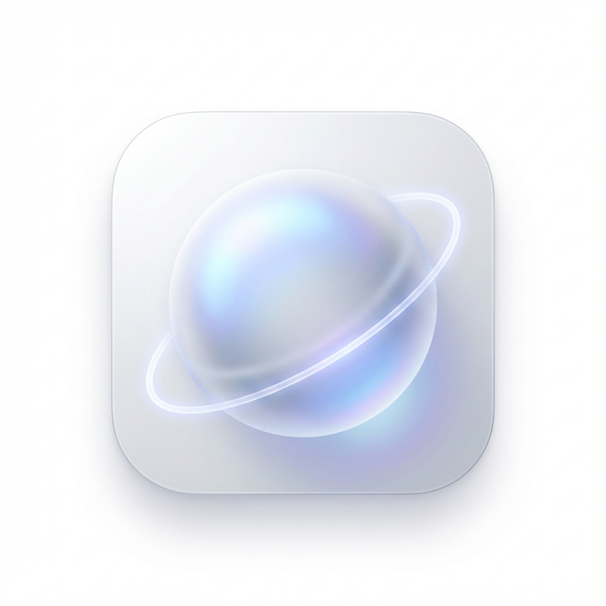

<p align="center">
  
</p>

<h1 align="center">🪐 Gravity Study</h1>

<p align="center">
  <b>Transform dead time into productive study time with AI-powered micro-quests</b>
</p>

<p align="center">
  <i>Hack'Vento 2026 | PS-5: Adaptive Student Time Utilization</i>
</p>

<p align="center">
  <a href="https://firebase.google.com/"></a>
  <a href="https://ai.google.dev/"></a>
  <a href="https://developers.google.com/"></a>
</p>

<p align="center">
  <a href="#-quick-start">Quick Start</a> •
  <a href="#-features">Features</a> •
  <a href="#-documentation">Docs</a> •
  <a href="#-demo">Demo</a> •
  <a href="#-team">Team</a>
</p>

---

## 🌌 The Vision

> *"Your gaps, our gravity. Pull yourself towards progress."*

Students waste **2+ hours daily** in unplanned gaps between classes. When lectures get cancelled or schedules misalign, this downtime becomes mindless scrolling instead of meaningful learning.

**Gravity Study** uses AI to transform those gaps into opportunities.

---

## ✨ What Makes Us Special

<table>
<tr>
<td width="50%">

### 🎯 Smart Gap Detection
Your timetable + our algorithm = automatic free time detection. Know exactly when you have gaps before they happen.

</td>
<td width="50%">

### 🤖 AI-Powered Micro-Quests
Gemini AI generates personalized study activities that fit your available time and subjects.

</td>
</tr>
<tr>
<td width="50%">

### 🗺️ Social Discovery
See nearby students on the Gravity Map. Find study buddies based on proximity and availability.

</td>
<td width="50%">

### 🎮 Gamified Progress
XP, levels, streaks, leaderboards. Make productivity addictive with space-themed gamification.

</td>
</tr>
</table>

---

## 🚀 Quick Start

```bash
# 1. Clone & Install
git clone https://github.com/your-username/gravity-study.git
cd gravity-study
npm install

# 2. Configure Environment
cp .env.example .env
# Edit .env with your Firebase + Gemini keys

# 3. Launch
npm run dev          # Web
npm run electron:dev # Desktop
```

> 📖 **Need detailed setup?** See [SETUP.md](./SETUP.md) for complete instructions including Firebase configuration.

---

## 🛸 Core Features

| Feature | Description | Powered By |
|:--------|:------------|:-----------|
| 📅 **Timetable Sync** | Input your schedule, auto-detect free gaps | Firebase |
| 🎯 **Gap Navigator** | AI suggests 5-60 min activities | Gemini AI |
| 🕳️ **BlackHole Timer** | Immersive focus mode countdown | — |
| 🗺️ **Gravity Map** | See nearby students & campus hotspots | Leaflet + Firebase |
| 🟢 **Orbit Status** | Set your availability (Available/Maybe/Busy) | Firebase Realtime |
| 💥 **Collision System** | Request study sessions with nearby peers | Firebase |
| 💬 **Real-time Chat** | Message your study buddies | Firebase |
| 🏆 **Leaderboard** | Compete with XP and streaks | Firestore |

> 🎬 **See all features in action!** Check out the [PROJECT_OVERVIEW.md](./PROJECT_OVERVIEW.md) for a complete walkthrough with screenshots.

---

## 📚 Documentation

| Document | Description |
|:---------|:------------|
| 📖 [**PROJECT_OVERVIEW.md**](./PROJECT_OVERVIEW.md) | Complete feature walkthrough with screenshots |
| 🛠️ [**SETUP.md**](./SETUP.md) | Detailed installation & configuration guide |
| 🔥 [**FIREBASE_SETUP.md**](./FIREBASE_SETUP.md) | Firebase project setup instructions |
| 🎤 [**PITCH.md**](./PITCH.md) | One-page pitch document for presentations |
| 🎬 [**DEMO_SCRIPT.md**](./DEMO_SCRIPT.md) | Step-by-step demo flow guide |

---

## 💫 Demo Flow

```
┌─────────────────────────────────────────────────────────────┐
│  1. 🔐 Login with Google                                    │
│              ↓                                              │
│  2. 📅 Enter your Timetable                                 │
│              ↓                                              │
│  3. 🎯 Gap Navigator: "You have 45 minutes free!"           │
│              ↓                                              │
│  4. 🤖 Gemini suggests: "Review DSA arrays (20 min)"        │
│              ↓                                              │
│  5. 🕳️ Start Quest → BlackHole Timer activates              │
│              ↓                                              │
│  6. 🗺️ Nearby peers appear on Gravity Map                   │
│              ↓                                              │
│  7. ✅ Complete quest → Earn 200 XP, climb leaderboard!     │
└─────────────────────────────────────────────────────────────┘
```

---

## 🛠️ Tech Stack

<table>
<tr>
<td align="center" width="96">

<br>React 18
</td>
<td align="center" width="96">

<br>TypeScript
</td>
<td align="center" width="96">

<br>Vite
</td>
<td align="center" width="96">

<br>Tailwind
</td>
<td align="center" width="96">

<br>Firebase
</td>
</tr>
<tr>
<td align="center" width="96">

<br>Gemini AI
</td>
<td align="center" width="96">

<br>Electron
</td>
<td align="center" width="96">

<br>Capacitor
</td>
<td align="center" width="96">

<br>Leaflet
</td>
<td align="center" width="96">

<br>Zustand
</td>
</tr>
</table>

---

## 🏫 Built for IET DAVV, Indore

Pre-configured campus hotspots ready for use:

| 📚 IET Central Library | 💻 CS Lab Block | ☕ IET Canteen |
|:----------------------:|:---------------:|:--------------:|
| 🌳 Campus Garden | 📝 Seminar Hall | 🎯 Main Lobby |

**Campus Coordinates:** `22.6811°N, 75.8800°E`

---

## 📦 Available Scripts

| Command | Description |
|:--------|:------------|
| `npm run dev` | Start development server |
| `npm run build` | Build for production |
| `npm run electron:dev` | Run Electron app |
| `npm run electron:build` | Build Windows desktop app |
| `npm run capacitor:android` | Run on Android device |

---

## 🌐 Live Demo

<p align="center">
  <a href="https://gravity-study.netlify.app/">
    
  </a>
  &nbsp;&nbsp;
  <a href="https://github.com/username/gravity-study/releases">
    
  </a>
</p>

---

## 👥 Team

<table>
<tr>
<td align="center">
<b>Pratham</b><br/>
<sub>Lead Software Engineer</sub><br/>
<sub>Full Stack & Architecture</sub><br/>
<a href="https://github.com/prathamtagad">

</a>
</td>
<td align="center">
<b>Prashray</b><br/>
<sub>AI & Data Specialist</sub><br/>
<sub>Gemini Algorithms & Logic</sub><br/>
<a href="https://github.com/Prashray21">

</a>
</td>
<td align="center">
<b>Samarth</b><br/>
<sub>Product Designer</sub><br/>
<sub>UI/UX & Frontend Interaction</sub><br/>
<a href="https://github.com/Samarthpurohit">

</a>
</td>
</tr>
</table>

<p align="center">
  Built with ❤️ for <b>Hack'Vento 2026</b> | GDG on Campus IET DAVV
</p>

---

## 📄 License

MIT License — feel free to adapt for your own campus!

---

<p align="center">
  
</p>

<p align="center">
  <b>🪐 Gravity Study</b><br/>
  <i>"Your gaps, our gravity. Pull yourself towards progress."</i>
</p>
